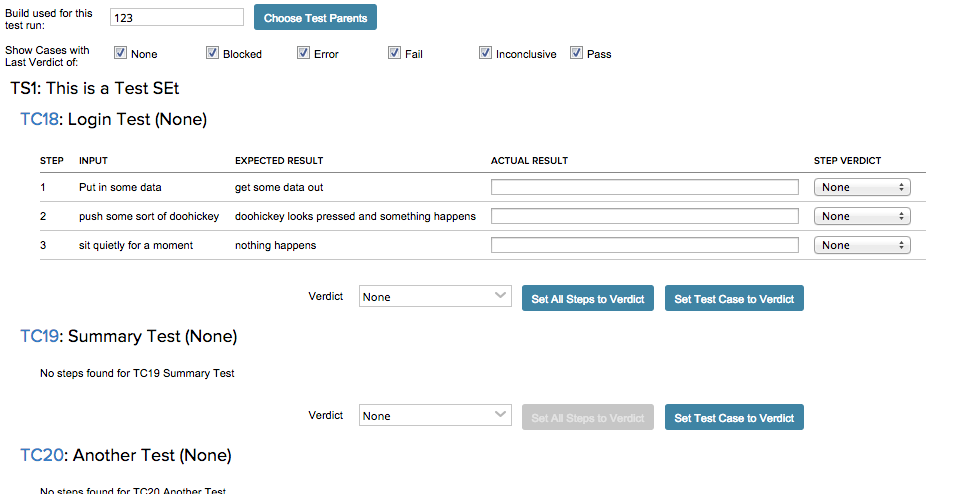
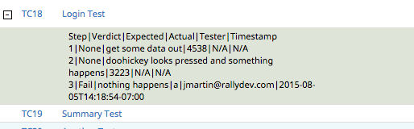

#Test Runner

This app allows you to execute a series of tests and capture failures at the step level.

You can choose a set of tests associated with test sets or stories in an iteration.  Once
chosen, the test cases appear with their steps.

For each test step, you can record an actual result and a verdict.  Then, for the test case, 
you can choose to set a verdict for the test case overall.  

The step results are saved as a note on the Test Case Result when the overall test case verdict
is saved.  

If the test case verdict is "Fail", then you are asked if you would like to create a defect.  Saying
yes will take you to the page for creating a defect.  The defect will automatically be associated with
the test case.

NOTE: Because of changes to the Rally UI (introduction of the new edit details page), creating a defect 
now takes the user away from the app so when she is done creating a defect, the test is no longer in
progress.

The test case step verdicts are pipe separated and stuffed into the notes of the result:

## Development Notes

### First Load

If you've just downloaded this from github and you want to do development, 
you're going to need to have these installed:

 * node.js
 * grunt-cli
 * grunt-init

If you have those three installed, just type this in the root directory here
to get set up to develop:

  npm install

### Structure

  * src/javascript:  All the JS files saved here will be compiled into the 
  target html file
  * src/style: All of the stylesheets saved here will be compiled into the 
  target html file
  * test/fast: Fast jasmine tests go here.  There should also be a helper 
  file that is loaded first for creating mocks and doing other shortcuts
  (fastHelper.js) **Tests should be in a file named <something>-spec.js**
  * test/slow: Slow jasmine tests go here.  There should also be a helper
  file that is loaded first for creating mocks and doing other shortcuts 
  (slowHelper.js) **Tests should be in a file named <something>-spec.js**
  * templates: This is where templates that are used to create the production
  and debug html files live.  The advantage of using these templates is that
  you can configure the behavior of the html around the JS.
  * config.json: This file contains the configuration settings necessary to
  create the debug and production html files.  Server is only used for debug,
  name, className and sdk are used for both.
  * package.json: This file lists the dependencies for grunt
  * auth.json: This file should NOT be checked in.  Create this to run the
  slow test specs.  It should look like:
    {
        "username":"you@company.com",
        "password":"secret"
    }
  
### Usage of the grunt file
####Tasks
    
##### grunt debug

Use grunt debug to create the debug html file.  You only need to run this when you have added new files to
the src directories.

##### grunt build

Use grunt build to create the production html file.  We still have to copy the html file to a panel to test.

##### grunt test-fast

Use grunt test-fast to run the Jasmine tests in the fast directory.  Typically, the tests in the fast 
directory are more pure unit tests and do not need to connect to Rally.

##### grunt test-slow

Use grunt test-slow to run the Jasmine tests in the slow directory.  Typically, the tests in the slow
directory are more like integration tests in that they require connecting to Rally and interacting with
data.
